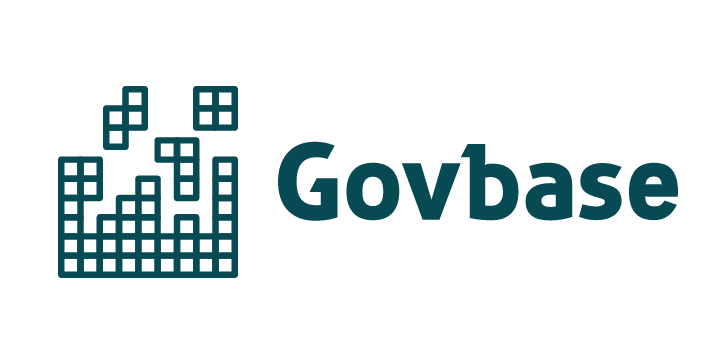

**Govbase** is a warehouse of qualitative and quantitative data sets relating to the governance of online communities. Govbase is [hosted on Airtable](https://airtable.com/shrgnUrj0dqzZDsOd) as a series of linked data tables with curated views. 

Govbase is maintained by [Metagov](https://metagov.org) and supports a variety of Metagov projects as well as external collaborations.

- [**The data**](#the-data) 
- [**Getting involved**](#getting-involved)

## The data

### Overview
Govbase is organized into [tables](https://en.wikipedia.org/wiki/Table_(database)) of related and interlinked data. Navigate between tables with the **Airtable tabs**. 

For each table, Metagov has curated [views](https://en.wikipedia.org/wiki/View_(SQL)) to look at subsets of the data. Navigate between views with the **Airtable sidebar**. Each table has an "All records" view with every available row and column for the data set, in addition to filtered, sorted, and grouped views. If you don't see the view you need, let us know and we can help you create it!

### Tables

Click on the table name for further information. Click on the Govbase link to see the table in Govbase.

| Table | Description                                                       | Examples                                           | Link |
|-------------------------------|-------------------------------------------------------------------|----------------------------------------------------|------|
| [Projects](./docs/projects) | Platforms, software, and research in online governance | Discourse, SourceCred, Open Collective, Aragon     | [Govbase](https://airtable.com/shrgnUrj0dqzZDsOd/tblvk3EFzcoCFvXXi/viwTisATNcua7os4y) |
| [Organizations](./docs/organizations) | Organizations and communities that develop, use, or fund projects | Board of directors of Facebook, OlympusDAO, Impact Collective | [Govbase](https://airtable.com/shrgnUrj0dqzZDsOd/tblNFm5I8KotgPNNS/viwEaKcLbdb2T5b3Q) |
| [Structures](./docs/structures) | Concepts and institutions from social science; source of labels | Quadratic voting, democracy, online community, DAO | [Govbase](https://airtable.com/shrgnUrj0dqzZDsOd/tblm1Lfumna1vlGaQ/viwyMnier3mnrvcHX) |
| [Social Ontologies](./docs/ontologies) | Theories and frameworks within which Structures are defined | Mathematical game theory, Constitute | [Govbase](https://airtable.com/shrgnUrj0dqzZDsOd/tblXLaQeoKygb4ais/viw3rNQQfK1S6ipfe) |
| [Instances](./docs/instances) | Junction table from relation "Organization uses project" | "The Metagovernance Project uses Govbase" | [Govbase](https://airtable.com/shrgnUrj0dqzZDsOd/tbl5H7mz84HXMIvuy/viwIQ1hXjEB0kPW07) |
| [Cases](./docs/cases) | Events, experiments, and lived experiences of online communities  | The DAO hack, Gamergate vs Wikipedia | [Govbase](https://airtable.com/shrgnUrj0dqzZDsOd/tblqYoJJKkPnteCbP/viwPOnvn9Xd73A5dW) |
| [Documents](./docs/documents) | Primary-source documents of project and organizations governance  | Bylaws of Social.coop, License of Keybase | [Govbase](https://airtable.com/shrgnUrj0dqzZDsOd/tblh8o2b7sNPq2yGz/viwUEtsRJkkp5L1P8) |
| [Constitutional Model](./docs/constitutional-model) | Model of web3 project and organization governance documents | Rights, values and goals defined in the Constitution of Decred |  [Govbase](https://airtable.com/shrgnUrj0dqzZDsOd/tbltBIhUFqZE1tfle/viw6J9mO9wrlSh3cg) |
| [Cryptogov Survey](./docs/cryptogov) | Primary data from the Cryptogov governance assessment | Analyzed survey responses of projects |  [Govbase](https://airtable.com/shrgnUrj0dqzZDsOd/tblYWk1xdCxhhohgL/viwbpL2ZQQimvsGtc) |
| [Cryptogov Metrics](./docs/cryptogov) | Metrics identified for the Cryptogov governance assessment | Number of nodes, Software quality | [Govbase](https://airtable.com/shrgnUrj0dqzZDsOd/tbl1Zq9LLgpcW7EZs/viwYnpB7331O6AHhL) |
| [Cryptopolitical Typology Quiz](./docs/cryptopolitics) | Primary data from the Cryptopolitical Typology Quiz | Anonymized survey responses of individuals | [Govbase](https://airtable.com/shrgnUrj0dqzZDsOd/tblvwbt4KFm8MOSUQ/viwfF8wIITUoDzNEn) |
| [Entity-Decision Model](./docs/ed-model) | Entities and decisionmaking processes involved in a project | Token holders govern 1Hive by coin voting | [Govbase](https://airtable.com/shrgnUrj0dqzZDsOd/tbllAED0vCyzbTiw8/viwySREZ6xNsVocRw) | 
| [Contract Objects](./docs/smart-contracts) | Solidity smart contract objects for DAO governance frameworks | Moloch's `submitProposal` function, Jur's `Vote` struct |  [Govbase](https://airtable.com/shrgnUrj0dqzZDsOd/tbl0kGdUES0KtBXlH/viwYBzuLn6GtrmVcn) |
| [Contract Parameters](./docs/smart-contracts)  | Solidity smart contract parameters for DAO governance frameworks  | `termParams` state variable, `_voter` function argument  |  [Govbase](https://airtable.com/shrgnUrj0dqzZDsOd/tbldPB1uhZot8oVT6/viw5mRJDJmAVT41Mo)
| [Parameters](./docs/parameters) | Endpoints and parameters for a platform or service configuration | Snapshot `vote` endpoint has parameters such as `choice` | [Govbase](https://airtable.com/shrgnUrj0dqzZDsOd/tblp5kVnv5P2yhppZ/viwjyRrh7xEng69XD) |
| [Parameter Model](./docs/parameters) | Model of parameter patterns observed in Parameters table | Voting creation, voting adminstation | [Govbase](https://airtable.com/shrgnUrj0dqzZDsOd/tblPbKLkWeRRriBDK/viwgkNVEaFKkXXPJG) | 
| Metaeth Observations | Placeholder for Metaethnograpy project | TBD |  |

## Getting involved
Govbase is a crowdsourced, community effort. We’re always looking for more editors, contributors, and research partners. If you would like to do research with Govbase, contribute data, or if you have an existing mapping project that you’d like to integrate, please get in touch!

If you see that Govbase is missing a project, organization, or document you think is relevant to the governance of online communities, **contribute to Govbase by adding a new entry!** Fill out a submission form:
- for a new [project](https://airtable.com/shr1BcXojViDgTOdX)
- for a new [organization](https://airtable.com/shrH8YqwrQMTrFUOu)
- for a new [governance document](https://airtable.com/shrYcazDD1l2xG65m) (you may need to submit a new project or organization if those relevant to the document are not yet in Govbase)

If you want to access the Airtable API, you will need an Airtable account and to request editor access to the base from Metagov. The auto-generated Airtable API documentation can be found [here](https://airtable.com/appx3e9Przn9iprkU/api/docs). 

## License
The contents of this repo are available under a MIT license. The data set itself is available under a [Creative Commons BY-NC-SA 4.0 license](https://creativecommons.org/licenses/by-nc-sa/4.0/).

## Acknowledgements
Contributors: Lucia Korpas, Joshua Tan, Michael Zargham, Ann Brody, Ellie Rennie, Kelsie Nabbens, and Campbell McNolty. Part of [Metagov](https://metagov.org).

Govbase is inspired by and draws on data from several other mapping initiatives, including the Civic Tech Field Guide, Democratic Mediums, Democracy Foundation, CredCatalog, DAOs in the Wild, DAObase, and Participedia. We would also like to thank Jeff Emmett, Nathan Schneider, Nastia Sadovnik, and Burrrata for their helpful comments and suggestions. 
