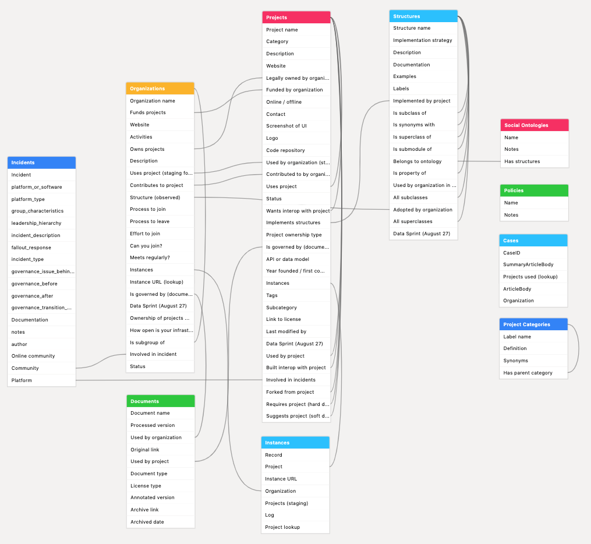

# Govbase Documentation v0.1

## API
The auto-generated Airtable API documentation can be found here: https://airtable.com/appx3e9Przn9iprkU/api/docs. To access the Airtable API, you will need an Airtable account and editor access to the base (Airtabl will generate a key for you).

## Tables
Govbase is organized into three main tables: **Projects**, **Organizations**, and **Structures**.

| Table         | Description                                                       | Examples                                           |
|---------------|-------------------------------------------------------------------|----------------------------------------------------|
| Projects      | Platforms, software, and research in online governance            | Discourse, SourceCred, Open Collective, Aragon     |
| Organizations | Organizations and communities that develop, use, or fund projects | Enspiral, MetaGame, Knight Foundation              |
| Structures    | Concepts and institutions from social science; source of labels   | Quadratic voting, democracy, online community, DAO |

**Projects**: A project is a discrete, re-usable software or research product. Includes code libraries, online platforms, online services, APIs, standards, protocols, and data sets.

**Organizations**: A (social) organization is an entity composed of individuals gathered for a common purpose. Includes online communities, companies, nonprofits, and funders involved in online governance.

**Structures**: A (governance) structure or institutional pattern is a scientific or technical description of a set of similar social behaviors and practices. Used mostly as a source of labels for **Projects**. 

### Projects
Most fields in the **Projects** table are pretty straightforward.

*Year founded*: If not obvious, use year of first commit.

*Status*: A project is inactive if it has been at least 2 years since the last commit. It's dead if the code and/or service is no longer accessible.

*Online/offline*: is the project specifically intended for online communities or offline communities? If not clear, say "not specific". If it is not intended for either (e.g. Linux), say "Not community-related". Intended to distinguish online governance tools like SourceCred from primarily offline tools like Consul (this later category of tools often gets classified under the heading of "civic tech", e.g. https://civictech.guide/).

*Implements structures*: a This is meant as, "this project implements or helps implement a community or organization with these observed structures." Alternately: "after using this project, an organization will likely demonstrate these observed structures." E..g Aragon implements DAOs, CIVS implements voting, and so on.
 
*Category*: possible values are
1. "product": libraries, tools, applications, and even services
2. "platform": hosted applications that communities interact on
3. "standard": includes protocols and text standards. Communities can interact via protocols, but protocols aren't hosted like platforms are.
4. "mashup": mashup of several platforms or products. My prototypical example is [vTaiwan](https://info.vtaiwan.tw/).
5. "research" includes data sets (like Govbase!) and algorithms. It does NOT include papers.

*Project ownership type*: possible values are
1. "Public domain": the project's code or content is not held under copyright
2. "Open-source": the project's code or content is available for use under an open-source or open-content license
3. "Open-core": a significant part of the project's code or content is available for use under an open-source or open-content license
4. "Privately-owned": the project's code or content is privately-owned

*Legally owned by organization*: The owner controls decisions and changes about the project. If a project is open source, the "owner" is the owner of the repository who maintains access controls to the repository.

*Is governed by (documentation)*: requires an entry to be created first in the Documents table; use the [Add new document form](https://airtable.com/shrYcazDD1l2xG65m).

*Used by project*: a staging column for more precise ways in which two projects interact, i.e. *Requires project (hard dependency)*, *Suggests project (soft dependency)*, *Forked from project*, and *Built interop with project*

*Wants interop with project*: this is subjective, and is ideally articulated by the developer her/himself.

### Organizations
The **Organizations** table is intended to provide context for **Projects**. It is not intended to be a comprehensive representation of an organization or of an online community.

*Structure (observed)*: the organizational structure(s) adopted by the organization. E.g. the Apache Software Foundation is a nonprofit organization, r/Teenagers is an online community, the City of Basel is a municipality, and Enspiral is both a nonprofit organization and an online community.

*Activities*: user-contributed tags. Current possible values are:
1. product: the organization specializes in providing products or services for sale.
2. investments/grants: the organization specializes in funding projects hosted by OTHER organizations and non-employee individuals.
3. research: the organization specializes in research and development (academic or applied).
4. social: the organization is dedicated to entertainment or socializing.
5. DeFi: decentralized finance (specific to DAOs and blockchains)                 

*Is governed by (documents)*: requires an entry to be created first in the Documents table; use the [Add new document form](https://airtable.com/shrYcazDD1l2xG65m).

The following columns describe how the organization interacts or participates in different projects.
- *Owns projects*: is the legal owner of the project and/or holds administrative rights to an open-source project
- *Contributes to project*:
- *Uses project (staging for Instances)*: 
- *Instances*: link to junction table (Instances) of instances of tools being used by organizations

The following columns describe different governance features of online communities, and may only be applicable to online communities: 
- *Size*
- *Do you need permission to join?*
- *Other requirements to join*
- *Total effort to join*
- *How do members meet?*
- *Process to leave*

*How open-source is your infrastructure?*: this score is calculated by averaging over the "openness" of the projects that the organization uses for governance, using the following openness score assignment:
- 4 if "Project ownership type" = "Public domain"
- 3 if "Project ownership type" = "Open-source"
- 2 if "Project ownership type" = "Open-core"
- 1 if "Project ownership type" = "Privately-owned"
- 1 if "Project ownership type" is empty

### Structures
The design of this table is still an area of active research! The goal of the Structures table is not to provide a complete view of all social behaviors or to articulate a consistent ontology, but to provide a shared view through which we can compare and begin to relate existing, disparate ontologies for governance, constitution-making, platform design, and online behavior.

*Belongs to ontology*: a link to the **Social Ontologies** table.

*Is subclass of*: class A is a subclass of class B if all patterns and instances described by A are also patterns or instances of B. 

*Is component of*: class A is a component of class B if the patterns and instances described by A are used to implement or construct the patterns described by B. For example, a rule is a component of a larger governance system, but not all rules are, on their own, governance systems.

*Is property of*: class A is a property of class B if class A can be defined as a predicate on instances of B. For example, "proportional representation" is a property of a legislature.

## Schema

